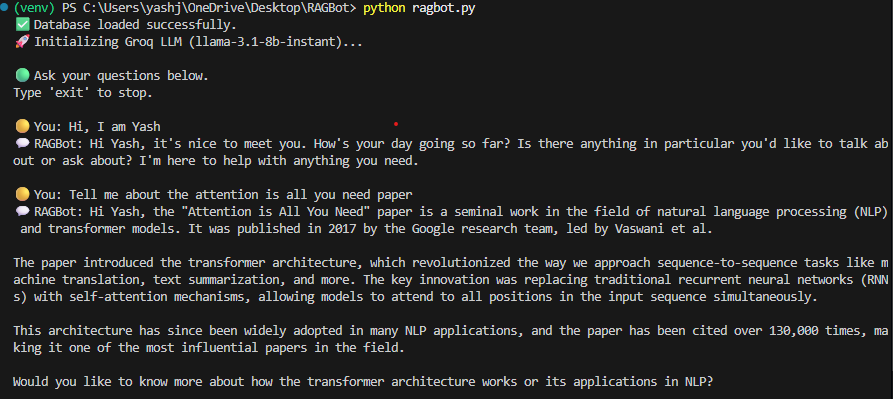
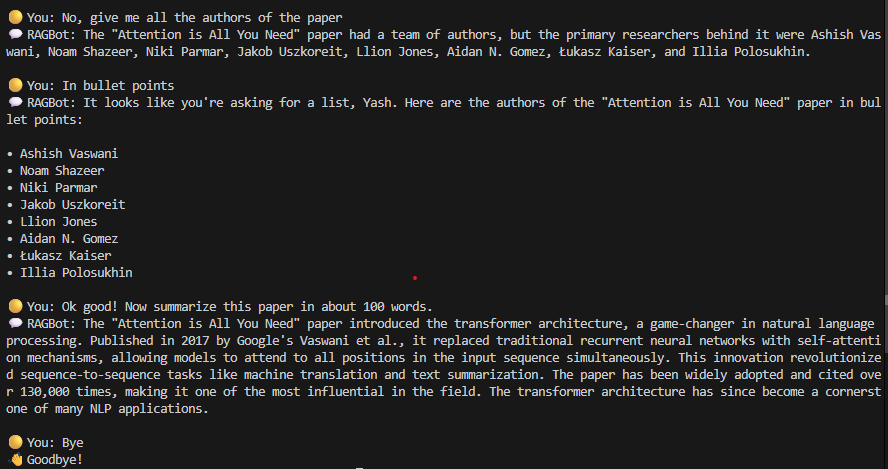

✨ Project Title

RAGBot — Conversational AI powered by LangChain & Groq

💡 Description

RAGBot combines document retrieval and large language models to build an AI chatbot that can read and answer questions from your own files.
This project demonstrates:

Retrieval-Augmented Generation (RAG) architecture

Efficient embeddings and vector search

Integration with Groq’s Llama-3.1-8B-Instant model for fast inference

Persistent Chroma vector database to avoid repeated ingestion

🧩 Tech Stack
Component	Description
Language	Python 3.10+
Framework	LangChain
LLM Provider	Groq (Llama 3.1-8B Instant)
Embeddings Model	Sentence Transformers — all-MiniLM-L6-v2
Vector Store	Chroma
Document Loader	PyPDFLoader
Env Management	python-dotenv

⚙️ Installation

1. Clone this repository

    git clone https://github.com/<your-username>/RAGBot.git
    cd RAGBot

2. Create a virtual environment

    python -m venv venv
    venv\Scripts\activate   # for Windows
    # or
    source venv/bin/activate   # for Mac/Linux

3. Install dependencies

    pip install -r requirements.txt

4. Add your API key

    GROQ_API_KEY=your_groq_api_key_here

▶️ Run your Code

    python ragbot.py

🧠 How It Works

1. PDF Ingestion

    To add new documents for your RAGBot to learn from:

    1. Place your PDF files inside the data/ folder.

    2. Run the bot using:

        python ragbot.py

    3. The script will automatically:

        Load and read your PDFs

        Split them into smaller text chunks

        Generate embeddings

        Store them in the chroma_db/ folder for future use

    👉 You don’t need to manually call any ingestion function — it all happens automatically the first time you run the bot.

2. Vector Database Creation

    Embeddings are stored in chroma_db/ for reuse.

3. RAG Query Pipeline

    When you ask a question, the system retrieves the top relevant chunks from Chroma.

    The retrieved content + your question are passed to the Groq LLM.

4. Conversational Memory

    The bot maintains chat history context for natural, continuous conversation

📸 Output Example

  
   
  

⚡ Requirements
• langchain
• langchain-core
• langchain-community
• langchain-text-splitters
• langchain-groq
• langchain-huggingface
• langchain-chroma
• chromadb
• sentence-transformers
• pypdf
• python-dotenv

👨‍💻 Author & Acknowledgments

    Author: Yash Jain

    📍 Built with using LangChain & Groq
    🧠 Inspired by open-source RAG pipelines and LLM integration techniques.
